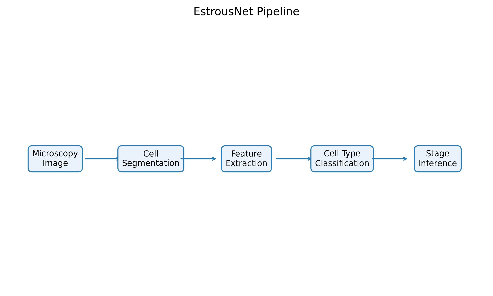
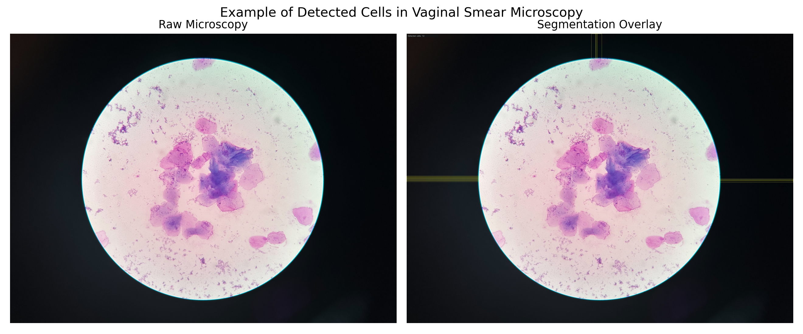
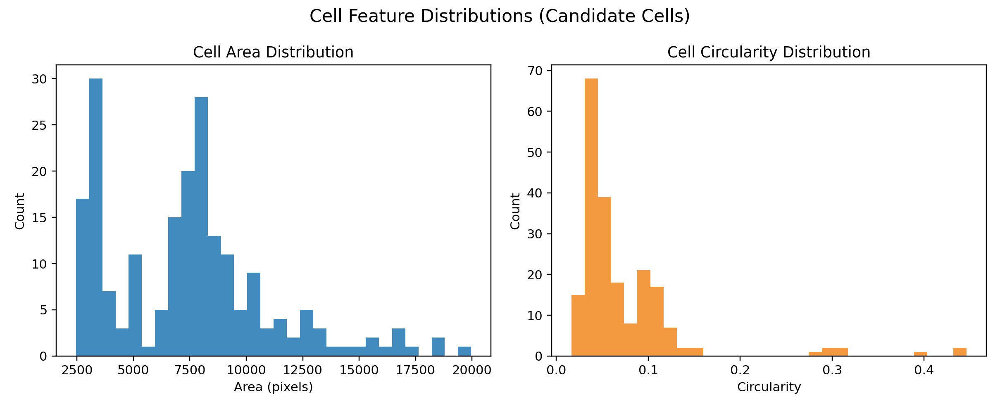

# EstrousNet

Automated estrous cycle stage detection from vaginal smear microscopy images.

This repository is a **biomedical image analysis prototype** focused on:

- interpretable pipeline design
- semi-automatic annotation workflow
- reproducible experiment structure

## Pipeline



Microscopy image -> cell segmentation -> feature extraction -> cell type classification -> stage inference

## Segmentation Example



## Cell Feature Distribution



## Dataset

- 18 microscopy images from laboratory practice.
- Current repository tracks pipeline code and example outputs.
- Raw microscopy images may be excluded from version control depending on data-sharing constraints.

## Annotation Workflow

1. Generate candidate cells and patches:

```bash
python scripts/generate_cell_candidates.py --save_overlay
```

2. Review and label:

```bash
python scripts/review_cell_candidates.py
```

3. Export training table:

```bash
python scripts/export_labeled_features.py
```

4. Train baseline classifier:

```bash
python scripts/train_cell_classifier.py --labeled_features_csv data/annotations/labeled_cell_features.csv
```

5. Run image-level inference:

```bash
python run_pipeline.py --input_dir data/raw --output_dir results --stage_rules config/stage_rules.yaml
```

## One-Command Run (PowerShell)

Smoke:

```powershell
powershell -ExecutionPolicy Bypass -File scripts/run_workflow.ps1 -Mode smoke -SaveOverlay
```

Full:

```powershell
powershell -ExecutionPolicy Bypass -File scripts/run_workflow.ps1 -Mode full -SaveOverlay
```

## Current Baseline Status (2026-03-06)

What this version achieved:

- Built microscopy image analysis pipeline.
- Completed semi-automatic annotation workflow.
- Implemented cell-level feature extraction and rule-based stage inference.
- Structured a reproducible research-style repository.

Current limitations:

- labeled cells only 3
- classifier not yet meaningfully validated
- stage prediction collapsed to `Proestrus`
- more reviewed annotations are required for reliable evaluation

Failure reasons (current baseline):

- Too few labeled cells to train/validate a robust cell classifier.
- Segmentation quality is unstable across magnification and background conditions.
- Under-detection of leukocytes in some images biases stage rules.
- With weak cell typing, ratio-based stage inference collapses to one class.

Why development stops at this version:

- The next meaningful step is large-scale manual annotation, which is time-intensive.
- Without more labels, adding more models would increase complexity without reliable evidence.
- This repository is intentionally finalized as a transparent, reproducible prototype baseline.

Detailed baseline notes: [report/baseline_results.md](report/baseline_results.md)

## Repository Structure

```text
e:/MLphoto
├── config/
├── data/
├── analysis/
├── notebooks/
├── src/
├── scripts/
├── results/
└── report/
```
